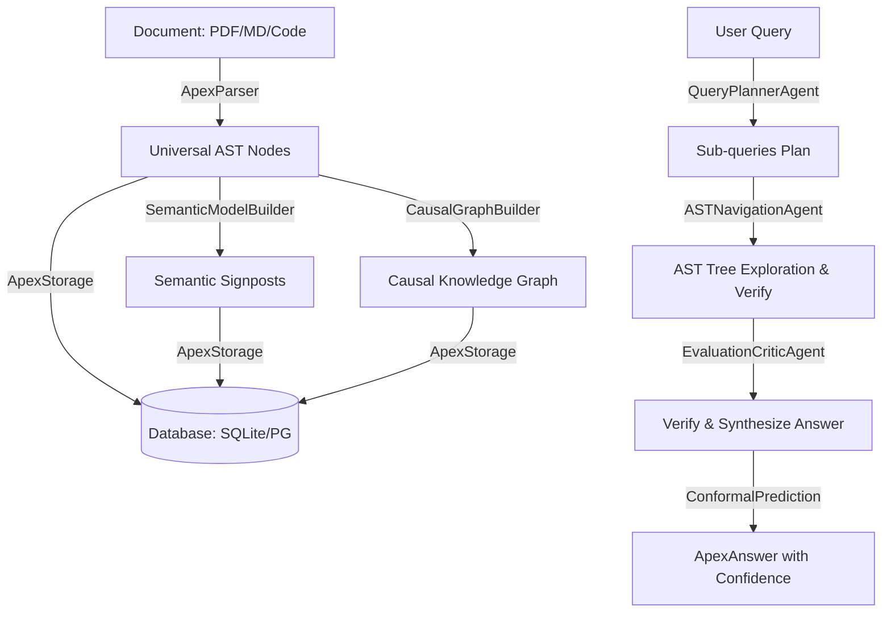

<p align="center">
  
  
  
</p>

<p align="center">
  <strong>The High-Accuracy, Local-First Structural Retrieval Infrastructure.</strong><br>
  <em>Stop guessing with vectors. Start navigating with agents.</em>
</p>

---

## 🚀 Overview

**ApexRAG** is a **Multi-Agent, Structural Reasoning Engine** built for precise enterprise document reasoning and RAG deployments.

Traditional RAG relies entirely on flat vector proximity search, chopping documents into arbitrary chunks. This approach destroys the document's logical hierarchy (like headings, sections, table boundaries, and document structures), leading to loss of context and hallucinations. 

ApexRAG resolves this by converting files into a strict **Universal Document AST (Abstract Syntax Tree)** and using an Orchestrator of specialized LLM Agents (Planner, Navigator, Critic) to explicitly navigate the document structure to retrieve exact, verifiable answers with rigorous confidence guarantees.



---

## 🏗️ The 3-Phase Architecture

### Phase 1: Structural Foundation
- **Universal Document AST:** Parsed documents are structured into hierarchical trees (`ASTNode`), preserving exact paragraph-to-heading structures.
- **Deterministic Retrievers:** Initial filtering uses keyword density, FTS5, and structural heading overlap to locate candidate nodes before any LLM calls.
- **Strict Verification:** A `StrictLeafVerifier` engine empirically checks if a found node actually answers the query, serving as a firewall against hallucinations.

### Phase 2: Structural Reasoning Engine
- **Multi-Agent Orchestrator:** Complex queries are broken down, navigated, and reviewed by a coordination loop:
    - **Planner Agent:** Deconstructs complex, multi-hop queries into discrete sub-queries.
    - **Navigator Agent:** Explores the AST tree and Semantic Map signposts to retrieve context for each sub-query.
    - **Critic Agent:** Evaluates and audits retrieved context to ensure all sub-queries are addressed before synthesizing the final response.
- **Structural Retrieval Graph (SRG):** Nodes have typed relations (e.g., `REFERENCES_TABLE`, `SUPERSEDES`), enabling non-linear reasoning.

### Phase 3: Enterprise Ecosystem Platform
- **Multi-Tenant RBAC:** Core SQLAlchemy models enforce strict data boundaries via `tenant_id` context.
- **Distributed Ingestion:** A `DistributedIndexer` allows scaling document parsing across workers using Redis or Celery queues.
- **Code Intelligence:** Includes a `PythonCodeParser` that extracts ASTs from source code files to enable precise code reasoning.
- **OpenTelemetry:** Distributed tracing tracks every agent action (`[PLANNING]`, `[NAVIGATING]`) in production.

---

## 📦 Installation

Install the stable core library from PyPI:

```bash
pip install apex-rag
```

To install with specific features or optional dependencies:

```bash
# Install with all extensions (web API, extra LLM SDKs, Postgres support)
pip install "apex-rag[all]"

# Install specific features
pip install "apex-rag[anthropic,groq,ollama]"  # Extra LLM Providers
pip install "apex-rag[gemini]"                  # Google Gemini
pip install "apex-rag[web]"                     # FastAPI server & CLI REPL
pip install "apex-rag[telemetry]"               # OpenTelemetry exporter
pip install "apex-rag[vectors]"                 # Vector embeddings (sentence-transformers)
pip install "apex-rag[postgres]"                # PostgreSQL backend
```


---

## ⚡ Quick Start

```python
import asyncio
from apex_rag import ApexIndex

async def main():
    # 1. Initialize ApexIndex (defaults to Ollama local Llama3.1)
    # Or use OpenAI: await ApexIndex.create(provider="openai", model="gpt-4o")
    async with await ApexIndex.create(provider="openai", model="gpt-4o") as index:
        
        # 2. Ingest document (converts to AST, builds graph, embeds)
        doc_id = await index.ingest("annual_report.pdf")
        print(f"Ingested document with ID: {doc_id}")
        
        # 3. Query (runs Planner -> Navigator -> Critic agent loop)
        answer = await index.query("What is the Q3 revenue change?", doc_id)
        
        # 4. View results & metadata
        print("\n--- Answer ---")
        print(answer.answer_text)
        print(f"Confidence Guarantee: {answer.coverage_guarantee * 100:.1f}%")
        print(f"Number of supporting packets: {answer.prediction_set_size}")

if __name__ == "__main__":
    asyncio.run(main())
```

---

## 📖 Complete API Usage Guide

### 1. Advanced Ingestion Options

You can ingest raw files, markdown text, or batches of files concurrently:

```python
# Ingest raw text/markdown directly
doc_id = await index.ingest_text(
    text="# Q3 Report\nRevenue grew by 15%.\n## Performance\nDetail notes...",
    doc_id="report_q3"
)

# Batch Ingestion of files and texts concurrently
doc_ids = await index.ingest_many([
    ("doc_1", "annual_report.pdf"),
    ("doc_2", "## Release Notes\nNo downtime recorded.")
])
```

### 2. Answer Token Streaming

Stream reasoning responses token-by-token for responsive client interfaces:

```python
async for token in index.stream_query("Compare Q2 and Q3 revenue", doc_id):
    print(token, end="", flush=True)
```

### 3. Enterprise Temporal (Time-Travel) Querying

Query the document repository as of a specific point in time or compare states across versions:

```python
from datetime import datetime, timezone

# Query the state of a document as it was on a specific date
result = await index.temporal_query(
    question="What is the active product pricing?",
    doc_id=doc_id,
    as_of=datetime(2025, 6, 1, tzinfo=timezone.utc)
)
print(result["result"])  # The resolved text answer
print(result["provenance"])  # Version history metadata

# Compare document/metric states between two points in time
comparison = await index.temporal_compare(
    question="Check pricing changes",
    doc_id=doc_id,
    date_a=datetime(2025, 1, 1, tzinfo=timezone.utc),
    date_b=datetime(2025, 6, 1, tzinfo=timezone.utc)
)
```

### 4. Enterprise RBAC & Role-Aware Querying

Restrict retrieval context dynamically based on user identity, roles, and tenants:

```python
from apex_rag import TenantContext

# Setup Tenant and Role credentials
tenant_ctx = TenantContext(
    tenant_id="enterprise-co",
    user_id="user_948",
    roles=["FinanceManager"]
)

# Execute role-aware query (performs masking and node access validation)
answer = await index.role_aware_query(
    question="Summarize executive bonuses",
    doc_id=doc_id,
    tenant_context=tenant_ctx
)
print(answer.answer_text)
```

### 5. Causal Graph Reasoning

Extract the underlying causal relationship graph constructed automatically during ingestion:

```python
import networkx as nx

# Retrieve full causal knowledge graph
graph: nx.DiGraph = await index.get_causal_graph()

# Inspect graph relationships
for source, target, data in graph.edges(data=True):
    print(f"[{source}] --({data['type']})--> [{target}] (Strength: {data['strength']})")
```

---

## 🛠️ CLI Interface

ApexRAG includes a powerful command-line interface to manage files, test queries, and run the API server.

```bash
# Start the FastAPI REST API server
python -m apex_rag serve --port 8000

# Ingest a file from the CLI
python -m apex_rag ingest financial_report.pdf --doc-id finance-2025

# Query an ingested document
python -m apex_rag query finance-2025 "Compare Q2 and Q3 revenue"

# Stream query response
python -m apex_rag stream finance-2025 "What is our tax rate?"

# Open interactive REPL session
python -m apex_rag repl

# Run system diagnostic checks
python -m apex_rag doctor
```

---

## 📦 CI/CD & Automated Publishing

ApexRAG leverages automated GitHub Actions workflows to test code and manage deployments cleanly:
- **Comprehensive Testing:** Unit tests, lint verification, and wheel build checks run automatically on every pull request across Python `3.10`, `3.11`, and `3.12`.
- **Manual Versioning & Clean Deployment:**
  1. Bump version locally in `pyproject.toml` (e.g. from `1.0.3` to `1.0.4`).
  2. Push the commit to the `main` branch.
  3. The CI/CD pipeline inspects the remote repository using `git ls-remote` to see if a release tag for this version exists.
  4. If the version is new, the pipeline tags the commit (e.g., `v1.0.4`), pushes the tag back to the remote repository, builds sdist & wheel packages, and deploys it to PyPI automatically.
  5. If the version hasn't changed, it exits cleanly without creating unnecessary bot commits or duplicate builds.

---

## 📄 License
MIT License. Copyright (c) 2026.
