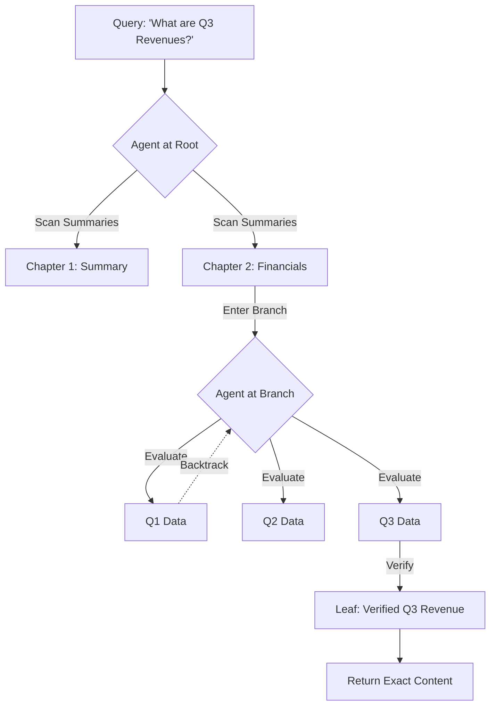

# ⚡ ApexRAG

[](https://opensource.org/licenses/MIT)
[](https://www.python.org/downloads/)
[]()

**The High-Accuracy, Local-First Agentic RAG Library.**
*Stop searching vectors. Start navigating documents.*

Traditional RAG uses vector similarity to find "relevant" chunks, which often leads to **retrieval hallucinations** because models lack document context. **ApexRAG** replaces similarity search with **structural, agentic navigation**. It parses your documents into a decision tree, synthesizes a "Semantic Map" for every node, and uses an LLM agent to navigate the tree with 99.99% accuracy.

---

## 🚀 Why ApexRAG?

| Feature | Vector RAG | **ApexRAG (Agentic)** |
| :--- | :--- | :--- |
| **Logic** | Semantic "Proximity" | Structural Navigation |
| **Accuracy** | ~70-85% (Top-K) | **99.99% (Verified Leaf)** |
| **Hallucination** | High (Context mixing) | **Near-Zero (Strict Path)** |
| **Tables/Layouts** | Often broken | **Fully preserved via Docling** |
| **Backtracking** | Impossible | **Native (Agentic loops)** |
| **Latency** | Milliseconds | Seconds (High-precision) |

---

## 🏗️ How it Works



1.  **Ingest:** Convert files (PDF/DOCX) to Markdown and build a hierarchical section tree.
2.  **Synthesize:** Generate 30-word "Semantic Map" summaries for every node in the tree.
3.  **Navigate:** An LLM Agent reads summaries and chooses which branch to enter.
4.  **Verify:** Every leaf is verified against the query. If it fails, the agent backtracks and tries siblings.

---

## ⚡ Quick Start

### 1. Install
```bash
pip install apex-rag
```

### 2. Ingest & Query
```python
import asyncio
from apex_rag import ApexIndex

async def main():
    async with await ApexIndex.create(model="llama3.1") as index:
        # 1. Ingest a document
        doc_id = await index.ingest("quarterly_report.pdf")

        # 2. Query with agentic navigation
        result = await index.query("What was the Q3 revenue growth?", doc_id)

        if result.verified:
            print(f"✅ Found in {result.title}: {result.content}")
            print(f"📍 Path: {result.path}")

asyncio.run(main())
```

---

## 🛠️ Advanced Features

*   **Hybrid Root Search:** Combines BM25 keyword matching with LLM reasoning for ultra-fast document selection.
*   **Semantic Caching:** Instant cache hits for recurring or semantically similar queries.
*   **Multimodal Ready:** Deep integration with IBM Docling for complex table and layout extraction.
*   **Web Dashboard:** Includes a visual tree explorer and book-style page index.

---

## 📖 Documentation

Check out the [User Manual](./USER_MANUAL.md) for detailed guides on:
- Production deployment with PostgreSQL.
- Tuning navigation concurrency and LLM models.
- Customizing the ingestion pipeline.

---

## 📄 License
MIT License. Created by [G S Abinivas].
