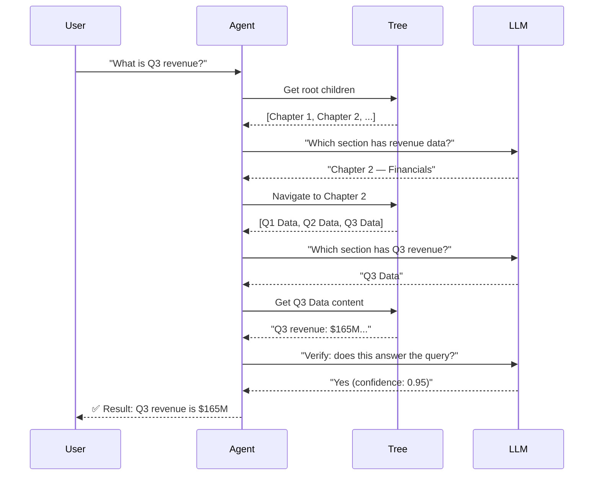

# Querying with Agentic Navigation

ApexRAG's core innovation is **agentic navigation** — using an LLM to walk the
document tree instead of relying on vector similarity.

## How Navigation Works



## Basic Query

```python
result = await index.query("What was the Q3 revenue growth?", doc_id)
if result:
    print(f"Content: {result.content}")
    print(f"Section: {result.title}")
    print(f"Path: {result.path}")
    print(f"Verified: {result.verified}")
    print(f"Confidence: {result.confidence:.2f}")
```

## Query Result

`NavigationResult` contains:

| Field | Type | Description |
|-------|------|-------------|
| `content` | `str` | Exact leaf section text answering the query |
| `node_id` | `int` | Primary key of the leaf node |
| `path` | `str` | LTree path (e.g., `"2.1.3"`) |
| `title` | `str` | Section heading |
| `verified` | `bool` | Whether the LLM confirmed the answer |
| `confidence` | `float` | Self-reported confidence (0–1) |
| `trace` | `list[tuple]` | Complete navigation path as `(node_id, title)` pairs |

## Subtree Search

Restrict navigation to a specific subtree:

```python
# Get the tree first
tree = await index.get_tree(doc_id)

# Find a specific node ID
target_node = next(n for n in tree if n["title"] == "Financials")

# Query only within that subtree
result = await index.query(
    "What is the net profit?",
    doc_id,
    root_node_id=target_node["id"],
)
```

## Global Search

Search across all indexed documents:

```python
result = await index.query_global("What is our total revenue across all divisions?")
```

The agent first identifies relevant documents using keyword search (FTS5) and
LLM-based document selection, then navigates each candidate in order.

## Hybrid Search

Combine vector similarity + keyword BM25 + agentic navigation:

```python
# Requires sentence-transformers
pip install apex-rag[vectors]

result = await index.query(
    "What is the revenue growth percentage?",
    doc_id,
    hybrid=True,  # Enable hybrid search
)
```

Hybrid search enriches the agent's navigation with semantic hints, making it
faster and more accurate for complex queries.

## Streaming (Real-time)

Get real-time updates as the agent navigates:

```python
import asyncio

event_queue: asyncio.Queue = asyncio.Queue()

# Start query in background
task = asyncio.create_task(
    index.query("What is Q3 revenue?", doc_id, event_queue=event_queue)
)

# Read events in real-time
while not task.done() or not event_queue.empty():
    event = await event_queue.get()
    print(f"🔄 {event['event']}: {event.get('title', '')}")
```

## Semantic Caching

ApexRAG automatically caches query results. If you ask the same question again,
it returns instantly from the cache. The cache also handles substring-similar
queries (e.g., "Q3 revenue" and "What is Q3 revenue?" will match).

Cache entries have a TTL of 7 days and are pruned automatically.

## Performance Tips

1. **Verify leaves** — Keep `verify_leaves=True` for production. It adds one LLM
   call per leaf but eliminates hallucination.

2. **Use a cheaper verifier** — Set a smaller model for verification:
   ```python
   await ApexIndex.create(
       model="llama3.1",         # Smart navigator
       verifier_model="phi3",    # Cheaper verifier
   )
   ```

3. **Leverage the cache** — Repeated or similar queries hit the cache instantly.

4. **Subtree pruning** — If you know the answer is in a specific section,
   use `root_node_id` to skip irrelevant branches.
