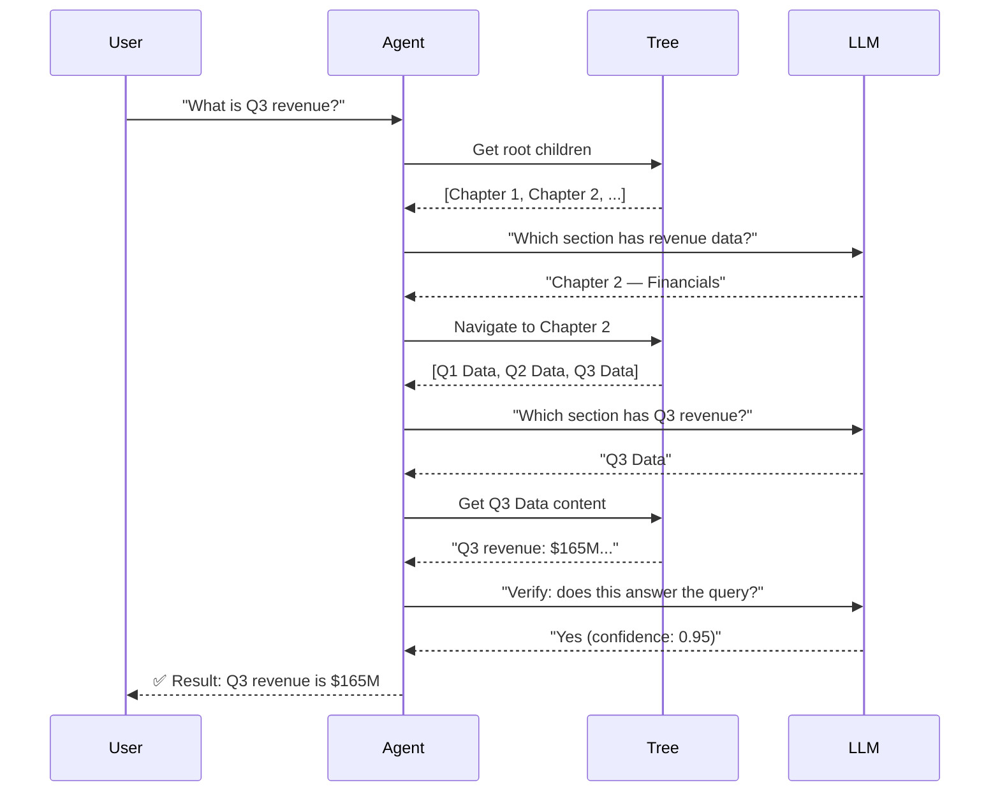

# Querying with Agentic Navigation

ApexRAG's core innovation is **agentic navigation** — using an LLM to walk the
document tree instead of relying on vector similarity.

## How Navigation Works



## Basic Query

```python
answer = await index.query("What was the Q3 revenue growth?", doc_id)

print(f"Answer: {answer.answer_text}")
print(f"Confidence Coverage Guarantee: {answer.coverage_guarantee:.2f}")

for idx, packet in enumerate(answer.evidence_packets):
    print(f"\n[Evidence {idx+1}]")
    print(f"Source Node: {packet.node_id}")
    print(f"Page Number: {packet.page_number}")
    print(f"Section Path: {packet.section_path}")
    print(f"Content: {packet.content}")
    print(f"Confidence: {packet.confidence:.2f}")
    print(f"Freshness: {packet.freshness_score:.2f}")
```

## Query Result

`ApexAnswer` represents the final output of the query pipeline:

| Field | Type | Description |
|-------|------|-------------|
| `answer_text` | `str` | The generated answer string, with inline citations |
| `evidence_packets` | `list[EvidencePacket]` | Fully annotated evidence blocks supporting the answer |
| `temporal_freshness` | `float` | Mean freshness score across all evidence packets (0–1) |
| `contradictions` | `list[CausalEdge]` | Conflicting temporal edits flagged during audit |
| `coverage_guarantee` | `float` | Conformal prediction confidence coverage level |
| `prediction_set_size` | `int` | Number of evidence packets in the prediction set |
| `causal_chain` | `list[CausalEdge]` | Reasoning chains linking evidence packets |
| `query` | `str` | The original user query |
| `latency_ms` | `float` | End-to-end latency in milliseconds |

### EvidencePacket

Each evidence packet in `evidence_packets` contains:

| Field | Type | Description |
|-------|------|-------------|
| `node_id` | `str` | UUID4 identifier of the matching ASTNode |
| `document_id` | `str` | ID of the source document |
| `page_number` | `int` | Page number in the source document |
| `section_path` | `str` | Node lineage path |
| `content` | `str` | Actual text of the retrieved section |
| `confidence` | `float` | Retrieval/verification confidence (0–1) |
| `freshness_score` | `float` | Freshness score (0–1) |

## Knowledge Graph Queries

ApexRAG builds **8 Knowledge DAGs** during ingestion and query time. You can query these edges programmatically:

```python
from apex_rag.models.unified_models import DagProjection

# Get all entity edges for a document
entity_edges = await index.get_edges_by_projection("entity", doc_id=doc_id)

# Get citation edges across all documents
citation_edges = await index.get_edges_by_projection(
    DagProjection.CITATION
)

# Get reasoning edges from the last query
reasoning_edges = await index.get_edges_by_projection(
    "reasoning", doc_id=doc_id, limit=100
)
```

### As a NetworkX Graph

```python
import networkx as nx

# Build a NetworkX graph from any projection
graph: nx.DiGraph = await index.get_projection_graph(
    "reasoning", doc_id=doc_id
)

for source, target, data in graph.edges(data=True):
    print(f"{source} --({data['type']})--> {target}  ({data['strength']:.2f})")
```

### Global Graph API

All 8 DAG projections are available via the REST API with enriched node metadata (content labels, node_type, page_number):

```bash
# All edges for a specific document
curl http://localhost:8000/documents/doc-123/graph

# Filtered by DAG projection
curl http://localhost:8000/documents/doc-123/graph/reasoning
curl http://localhost:8000/documents/doc-123/graph/entity

# Across ALL documents
curl http://localhost:8000/graph
curl http://localhost:8000/graph/citation
```

Each graph node includes:
```json
{
  "id": "uuid4...",
  "label": "Quarterly Revenue Growth Q3 2025",
  "group": "node",
  "node_type": "HEADING",
  "page_number": 42
}
```

## Subtree Search

To restrict navigation to a specific subtree, incorporate the target
section directly into your question:

```python
# Narrow the scope by referencing the section in the question
answer = await index.query(
    "In the 'Financials' section, what is the net profit?",
    doc_id,
)
```

You can inspect the document tree to find section names first:

```python
tree = await index.get_tree(doc_id)
for node in tree:
    if node["node_type"] == "HEADING":
        print(f"{node['node_id']}: {node['content']}")
```

## Global Search

Search across all indexed documents:

```python
answer = await index.query_global("What is our total revenue across all divisions?")
if answer:
    print(answer.answer_text)
    for pkt in answer.evidence_packets:
        print(f"  From document: {pkt.document_id}")
```

The agent iterates through all indexed documents, querying each one in
sequence, and returns the first answer with supporting evidence.

## Hybrid Search

Combine vector similarity + keyword BM25 + agentic navigation by setting
the ``domain`` parameter:

```python
# Setting domain to 'financial' or 'analytical' enables hybrid search
# under the hood (requires sentence-transformers)
pip install apex-rag[vectors]

answer = await index.query(
    "What is the revenue growth percentage?",
    doc_id,
    domain="financial",  # Enables hybrid search
)
```

Hybrid search enriches the agent's navigation with semantic hints, making it
faster and more accurate for complex queries.

## Streaming with ReasoningDAG

The `/query/stream/reasoning-graph` SSE endpoint streams real-time agent traces
during query execution, then delivers the full ReasoningDAG as a JSON graph:

```bash
curl -X POST http://localhost:8000/query/stream/reasoning-graph \
  -H "Content-Type: application/json" \
  -d '{"doc_id":"doc-123","question":"What is Q3 revenue?"}'
```

SSE events:
- `trace` — Real-time agent navigation step
- `reasoning_graph` — Full `{nodes, edges}` JSON graph after query completes
- `result` — Final answer text with coverage metrics

## Enterprise Features

Enterprise capabilities — temporal versioning, RBAC, and audit trails — are
accessed through the ``index.enterprise`` property.

### Temporal Queries

```python
from datetime import datetime, timezone

enterprise = index.enterprise

# Latest state
result = await enterprise.temporal_query(
    "What is the current revenue?", doc_id, latest=True,
)

# State as of a specific date
result = await enterprise.temporal_query(
    "What was the revenue on Jan 15, 2025?", doc_id,
    as_of=datetime(2025, 1, 15, tzinfo=timezone.utc),
)

# Compare two points in time
result = await enterprise.temporal_compare(
    "Compare revenue", doc_id,
    date_a=datetime(2025, 1, 1, tzinfo=timezone.utc),
    date_b=datetime(2025, 3, 31, tzinfo=timezone.utc),
)
```

### Version History & Lineage

```python
# Get full version history for a specific node
history = await enterprise.get_version_history(node_id)

# Trace the supersession chain
lineage = await enterprise.get_version_lineage(node_id)
```

### Role-Aware Query (RBAC)

```python
from apex_rag import TenantContext

# Query with enterprise RBAC enforcement
ctx = TenantContext(
    tenant_id="acme",
    user_id="alice",
    roles=["Analyst"],
)

answer = await enterprise.role_aware_query(
    "What is the net profit?",
    doc_id,
    tenant_context=ctx,
)

print(answer.answer_text)
# Only content the 'Analyst' role is authorized to see is returned
```

## Streaming (Real-time)

Get real-time updates as the agent navigates:

```python
import asyncio

event_queue: asyncio.Queue = asyncio.Queue()

# Start query in background
task = asyncio.create_task(
    index.query("What is Q3 revenue?", doc_id, event_queue=event_queue)
)

# Read events in real-time
while not task.done() or not event_queue.empty():
    event = await event_queue.get()
    print(f"🔄 {event['event']}: {event.get('title', '')}")
```

## Semantic Caching

ApexRAG automatically caches query results. If you ask the same question again,
it returns instantly from the cache. The cache also handles substring-similar
queries (e.g., "Q3 revenue" and "What is Q3 revenue?" will match).

Cache entries have a TTL of 7 days and are pruned automatically.

## Performance Tips

1. **Use the right domain** — Set the ``domain`` parameter to match your
   content type (``"financial"``, ``"legal"``, ``"analytical"``) for
   optimized freshness decay and retrieval strategy.

2. **Leverage the cache** — Repeated or similar queries hit the cache
   instantly, returning results in milliseconds.

3. **Conformal coverage** — Lower the ``coverage`` parameter for faster but
   less conservative results (default 0.90; minimum recommended 0.80):
   ```python
   answer = await index.query(
       "What is Q3 revenue?", doc_id,
       coverage=0.85,  # Slightly faster, still reliable
   )
   ```

4. **Subtree focusing** — If you know the answer is in a specific section,
   mention it in the question to guide the navigator:
   ```python
   answer = await index.query(
       "In the financial statements, what is Q3 revenue?", doc_id,
   )
   ```
